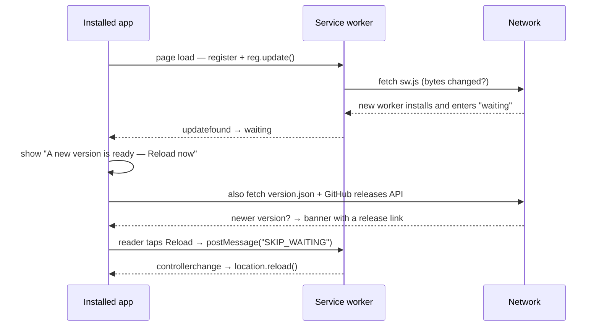
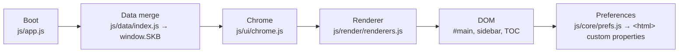

# Architecture

SikBodo (रावखान्थि) is a self-contained, academic-grade static web application for
learning Bodo (बर' राव). It has **no build step, no bundler and no runtime
dependencies**: the files committed to the repository are exactly the files the browser
executes. This document describes the runtime architecture — how content becomes DOM,
how the shared chrome is injected, how theming and display preferences work, and how the
site is deployed.

- Repository: <https://github.com/apsideslabs/SikBodo>
- Live site: <https://apsideslabs.github.io/SikBodo/>
- Version: 1.0.0 — Licence: MIT — Author: Apsides Labs

## Design constraints

These constraints shape every other decision in this document.

| Constraint | Consequence |
| --- | --- |
| No build step | `.html`, `.css` and `.js` are served verbatim by GitHub Pages. Editing a file and pushing is the whole "release". |
| No bundler, no ES modules | Shared code is loaded with classic `<script>` tags and communicates through globals. There is no `import`/`export` anywhere in the runtime code. |
| No runtime dependencies | Nothing is fetched from a CDN while the app runs. Icons come from a local SVG sprite at `assets/icons.svg`. |
| Portable | The repository root can be dropped on any static host and will work unchanged. |
| Accessibility is baseline | Semantic markup, a skip link and a keyboard-operable display panel are requirements, not enhancements. |
| Content is data | All teachable content lives in plain JavaScript objects under `js/data/`, separate from presentation. |

## Repository layout

```text
SikBodo/
├── *.html                     15 static pages (see below)
├── assets/
│   └── icons.svg              inline SVG sprite (Lucide-derived; ISC/MIT)
├── css/
│   ├── tokens.css             design tokens, light + dark themes
│   ├── layout.css             sidebar + prose grid
│   ├── components.css         buttons, cards, tables, panel
│   └── print.css              print stylesheet
├── js/
│   ├── app.js                 boot entry point
│   ├── core/
│   │   ├── store.js           in-memory app state
│   │   ├── prefs.js           persisted display preferences
│   │   └── icons.js           sprite helpers
│   ├── data/
│   │   ├── index.js           merges every module into window.SKB
│   │   ├── meta.js            site metadata + page inventory
│   │   ├── lessons.js  dictionary.js  phrases.js  dialogues.js
│   │   ├── script.js   grammar.js     verbs.js    numbers.js
│   │   └── culture.js  resources.js
│   ├── render/
│   │   └── renderers.js       one renderer per page
│   └── ui/
│       ├── chrome.js          header / footer injection
│       ├── sidebar.js         primary navigation
│       ├── panel.js           display panel (preferences)
│       └── toc.js             in-page table of contents
└── tools/
    ├── check-links.mjs        internal link checker
    └── build-sitemap.mjs      sitemap.xml generator
```

The fifteen pages are `index.html`, `lessons.html`, `script.html`, `grammar.html`,
`verbs.html`, `numbers.html`, `dictionary.html`, `phrases.html`, `conversations.html`,
`culture.html`, `quiz.html`, `translator.html`, `resources.html`, `about.html` and
`404.html`.

Every page follows the same skeleton:

```html
<body data-page="NAME">
  <a class="skip-link" href="#main">Skip to content</a>
  <header id="site-header"></header>
  <main id="main">…</main>
  <footer id="site-footer"></footer>
  <script src="js/data/index.js"></script>
  <script src="js/app.js"></script>
</body>
```

The `data-page` value is the routing key: it selects which renderer runs and which
navigation entry is marked current.

## The data layer

All teachable content lives in plain JavaScript objects under `js/data/`. Each module is
a classic script that defines a value on a shared namespace; it does **not** fetch
anything, and it holds no behaviour.

`js/data/index.js` is the merge point. It is loaded first on every page and is
responsible for assembling the individual modules into a single global, `window.SKB`.
Conceptually:

```js
// js/data/index.js
window.SKB = Object.assign({}, window.SKB, {
  meta, lessons, dictionary, phrases, dialogues,
  script, grammar, verbs, numbers, culture, resources,
});
```

Because `index.js` runs before `app.js`, the boot code can assume `window.SKB` exists
and is complete. Adding a new content module therefore means two edits: create
`js/data/<name>.js`, and add its symbol to the merge in `index.js`. Nothing else needs
to change for the data to be available.

Keeping data separate from presentation has three consequences worth stating:

1. Content can be reviewed and diffed without reading renderer code.
2. Renderers are pure functions of `window.SKB` plus the page key — they never fetch.
3. The whole content set can be validated by tooling (see `tools/check-links.mjs` and
   the CI workflow).

## Boot sequence

`js/app.js` is the single entry point. On `DOMContentLoaded` it:

1. Reads the page key from `document.body.dataset.page`.
2. Confirms `window.SKB` is present (the data layer has already run).
3. Applies persisted display preferences through `js/core/prefs.js` before first paint,
   so there is no flash of an unstyled or wrongly-sized page.
4. Calls `js/ui/chrome.js` to inject the shared header and footer into the two empty
   landmark elements.
5. Builds the sidebar navigation from the page inventory in `js/data/meta.js`
   (`js/ui/sidebar.js`).
6. Selects the renderer for the current page key from `js/render/renderers.js` and
   renders it into `#main`.
7. Scans the rendered prose for headings and builds the in-page table of contents
   (`js/ui/toc.js`).
8. Wires the display panel (`js/ui/panel.js`).

The boot is deliberately linear. There is no router: each `.html` file is a real page,
so navigation is ordinary browser navigation and the back button, deep links and
bookmarks behave as users expect.

## Chrome injection

The shared header and footer are **not** duplicated across fifteen files. Each page
ships empty `<header id="site-header">` and `<footer id="site-footer">` landmarks, and
`js/ui/chrome.js` fills them at runtime. This keeps the markup DRY and means a change to
the navigation or footer is a one-file change. The trade-off — a brief moment before the
chrome appears — is mitigated by injecting synchronously during boot, before the main
content render.

The header contains the site title, the display-panel toggle (a floating action button)
and the primary navigation trigger. The footer contains the licence, version and
attribution lines.

## The renderer pattern

`js/render/renderers.js` holds a map from page key to renderer function. Each renderer
has the shape:

```js
function renderLessons(root, data) {
  // build DOM from data.lessons and append into `root` (#main)
}
```

Renderers share these rules:

- They receive the mount element and the merged `window.SKB` object; they do not read
  globals directly and they do not fetch.
- They emit the page's single `<h1>` and a well-ordered heading hierarchy beneath it.
- They build elements with the DOM API or a small templating helper; any HTML they
  inject from content is content-authored HTML (the `body` field of a lesson), not
  user input.
- They are idempotent: re-rendering a page produces the same DOM.

Because renderers are pure and keyed by `data-page`, adding a page is a mechanical
operation (see "Adding a new page").

## CSS tokens and theming

Styling is layered, not monolithic:

| File | Responsibility |
| --- | --- |
| `css/tokens.css` | The design system. Colour, spacing, type scale and radius are declared once as CSS custom properties on `:root`, with a dark override under `[data-theme="dark"]`. |
| `css/layout.css` | The two-column sidebar + prose grid, responsive collapse, and reading measure. |
| `css/components.css` | Buttons, cards, tables, the display panel, badges and callouts. |
| `css/print.css` | Print-specific overrides loaded with `media="print"`. |

Themes are switched by setting `data-theme` on the `<html>` element. Components never
hard-code colour: they reference tokens such as `var(--color-text)` and
`var(--color-surface)`, so a theme change propagates everywhere at once and contrast can
be reasoned about in one place.

## Preferences and CSS custom properties

The display panel is the user-facing control surface for reading comfort. It exposes:

- theme (light / dark / system),
- text scale,
- line height,
- a reduced-motion preference,
- a romanisation visibility toggle.

`js/core/prefs.js` persists these choices and, on boot, writes them onto the document
root as CSS custom properties and attributes. Text scale, for example, is applied by
setting a root font-size custom property; line height is set as a multiplier on the prose
container. Because the values are custom properties, every component that already reads
`var(--…)` responds immediately, with no re-render and no class churn.

This is the reason the preference system lives in `js/core/` rather than in the panel
UI: the panel is a thin control layer, and the durable behaviour is a small, testable
module that mutates document-level state.

## Sidebar and table of contents

Two navigation aids are generated at runtime.

- **Sidebar** (`js/ui/sidebar.js`): built from the page inventory in `js/data/meta.js`.
  The entry whose key matches `data-page` receives `aria-current="page"`. Grouping
  (Learn / Reference / Practice) is derived from metadata, not hard-coded in the
  renderer.
- **Table of contents** (`js/ui/toc.js`): after `#main` is rendered, the TOC scans the
  prose column for `h2`/`h3` elements, ensures each has a stable `id`, and emits an
  ordered list of anchor links. This means authors never hand-maintain a contents list;
  adding a heading is enough.

## Deployment

The site is served by GitHub Pages from the `main` branch at the repository root. There
is **no deployment workflow**: merging to `main` publishes. This is intentional — with no
build step there is nothing to build, so a deploy job would only add a failure mode.

Operational consequences:

- The `main` branch must always be in a publishable state; CI (`.github/workflows/ci.yml`)
  is the gate that keeps it so.
- All asset paths are relative, so the site works both at the project URL
  (`/SikBodo/`) and when opened locally from the filesystem.
- `sitemap.xml` at the repository root is generated by `tools/build-sitemap.mjs` and uses
  the canonical base URL `https://apsideslabs.github.io/SikBodo/`.

## Service worker, offline and updates

`sw.js` is the service worker. It is registered by `js/ui/update.js` on every page (over
https or localhost only), which makes the whole site work offline once visited, and gives the
page a way to notice a new release.

| Request | Strategy |
| --- | --- |
| Navigations | network-first, cache fallback |
| CSS / JS / icons | stale-while-revalidate |
| `version.json`, `sw.js` | network-only |
| Cross-origin (GitHub API) | untouched |

The cache is named after the version (`luitra-1.2.0`), so activating a new worker deletes the
previous release's assets — there is no partial-update state. The worker deliberately does
**not** call `skipWaiting()` on install; it waits, and the page offers the reload instead.

The version number is written by hand in three files because there is no build step —
`js/data/meta.js`, `version.json` and `sw.js` — and CI fails if they disagree.



The update notice is the one piece of interface this project builds in JavaScript rather than
static markup — unlike the display panel, which is written into every page's HTML. The reason is
that the notice exists **only** in installed mode and its content is dynamic; nothing is lost if
the script fails, because it is an enhancement rather than a control surface. See
`docs/UPDATES.md`.

## Data flow

The runtime path from content to DOM is linear and easy to follow:



In words: `js/data/index.js` merges every content module into `window.SKB`; `js/app.js`
boots, injects the shared chrome, picks the renderer for the current `data-page`, and
renders it into `#main`; the sidebar and TOC are derived from the same data and the
rendered headings; and `js/core/prefs.js` projects the user's display choices onto the
document root as CSS custom properties.

## Adding a new page

Adding a page is a five-step recipe. Using a hypothetical `proverbs.html` as the example:

1. **Create the page.** Copy an existing page's skeleton and set
   `<body data-page="proverbs">`. Give it one `<h1>`, the skip link, and the two boot
   scripts (`js/data/index.js`, then `js/app.js`). Give the page a `<title>` and a
   `<meta name="description">` — both are required by the sitemap generator and CI.
2. **Add the data.** Create `js/data/proverbs.js` defining the module, and register it in
   the merge inside `js/data/index.js`.
3. **Register the page.** Add the page to the inventory in `js/data/meta.js` so the
   sidebar and any navigation lists include it.
4. **Write the renderer.** Add a `proverbs` entry to the renderer map in
   `js/render/renderers.js`. It must emit the single `<h1>` and a coherent heading order.
5. **Verify.** Run `node tools/check-links.mjs` and `node tools/build-sitemap.mjs`, then
   load the page and confirm the sidebar highlights it and the TOC builds.

## Conventions and invariants

- One `<h1>` per page; heading levels are never skipped.
- Every Bodo string is written in Devanagari script and paired with a romanisation.
- No emoji anywhere in the project; icons are inline SVG from the sprite.
- No runtime dependencies and no ES module syntax in shipped code.
- Content lives in `js/data/`, presentation in `js/render/` and `js/ui/`.
- The chrome is injected, never duplicated, so navigation changes are one-file changes.

## The gamified studio layer

The interface is a language studio rather than a static reader, and that lives in three places:

- **`js/core/store.js`** — the mastery engine. A failure-tolerant `localStorage` wrapper plus the
  XP model, the 15-rank ladder (`RANKS`), streaks, starred words and the learner profile. Every
  mutation dispatches `ax:progress` on `document`, which is how the header pill and the sidebar
  card stay in step without a framework.
- **`js/render/renderers.js` (`progress`, `lessons`, `dictionary`)** — the rank ladder, tier
  breakdown, trophy grid, skill path and word stars.
- **`js/render/interactive.js` (`quiz`)** — the Quiz Arena: multiple-choice and flashcard rounds,
  the streak counter, and the XP award path back into the store.

The design system itself (`css/tokens.css` … `css/components.css`) is the one from the Bodo
reference, adapted: the target-language stack `--font-bo` resolves to the Devanagari script, and
`--font-as` aliases it.
